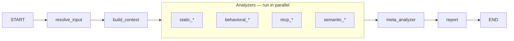

# Skillspector Development Guide

This guide helps developers understand, run, test, and extend the LangGraph-based skillspector workflow.

---

## 1. Overview

**skillspector** is a LangGraph workflow that scans a skill directory (or zip) and produces a SARIF 2.1.0 report, risk score, and formatted output (terminal, JSON, Markdown, or SARIF). It is the graph/engine for security analysis of AI agent skills.

**Entry points** are:

- **CLI** — run `skillspector scan <path-or-url>` (supports Git URL, file URL, .zip, .md file, or directory). Use `--format terminal|json|markdown|sarif`, `--output FILE`, `--no-llm`. See `skillspector --help`.
- **LangGraph dev server** — run `make langgraph-dev` to start the dev server and open **LangGraph Studio** in your browser. In Studio you can view the graph and run it with custom inputs (e.g. `skill_path`, `output_format`, `use_llm`).
- **Programmatic** — `from skillspector import graph` and call `graph.invoke(...)` or `graph.stream(...)`.

**Data flow (one sentence):** `resolve_input` (input_path or skill_path → `skill_path`, optional `temp_dir_for_cleanup`) → build context → parallel analyzers → meta_analyzer (LLM filter/enrich when `use_llm` is True) → report (SARIF + risk score + `report_body` from `output_format`). Caller cleans up `temp_dir_for_cleanup` after invoke when set.

---

## 2. Prerequisites and setup

**To get started:** create and activate a virtual environment, then install. All Makefile targets assume the venv is already created and activated.

```bash
# Create venv (use either uv or Python)
uv venv .venv
# or: python3 -m venv .venv

source .venv/bin/activate   # On Windows: .venv\Scripts\activate

make install-dev
```

- **Python**: 3.12+ (see [pyproject.toml](../pyproject.toml)). `make install` and `make install-dev` use **uv** if available (`uv sync` / `uv sync --all-extras`), otherwise **pip** (`pip install -e .` / `pip install -e ".[dev]"`). You must create and activate the virtual environment yourself before running any make target.
- **Environment**: Optional `.env` in the project root. The LangGraph dev server loads it (see [langgraph.json](../langgraph.json) `"env": ".env"`). Key variables:
  - **`SKILLSPECTOR_PROVIDER`**: Selects the active LLM provider — `openai`, `anthropic`, or `nv_build`. Defaults to `nv_build` when unset.
  - **Provider credential**: depends on the active provider — `NVIDIA_INFERENCE_KEY` (NVIDIA), `OPENAI_API_KEY` (OpenAI), or `ANTHROPIC_API_KEY` (Anthropic). See [llm_utils.py](../src/skillspector/llm_utils.py).
  - **`OPENAI_BASE_URL`**: Override the OpenAI endpoint (e.g. point at Ollama).
  - **`SKILLSPECTOR_MODEL`**: Override default model; see [constants.py](../src/skillspector/constants.py).

- **Logging**: Internal/operational logging uses the stdlib `logging` module. User-facing output uses Rich, through **two** consoles that [cli.py](../src/skillspector/cli.py) keeps apart: `console` writes to **stdout** and carries the report and `--version`, which is itself the output that was asked for. `advice = Console(stderr=True)` writes to **stderr** and carries everything else — advisories, progress lines, `Report saved to:`, `--repo-scan`'s per-skill digest, `_scan_multi_skill`'s `═══ Multi-Skill Summary ═══` table, errors and tracebacks. A new print site picks its console from that rule, not from its neighbour: the report goes to stdout so `skillspector scan . -f json | jq` is a real pipeline, and anything else printed there lands inside the report and breaks it. The rule is now applied rather than argued — the Multi-Skill Summary table used to be a case that had to be argued, because `--recursive --format terminal` with no `--output` wrote its combined report nowhere else and the table *was* the report, and the `summary = console if … else advice` predicate expressed that. Issue #114 gave the path the stdout fall-back every other one already has, so the table is a digest on every path, the predicate is gone, and the table's prints are plain `advice` calls. Note that the report also reaches stdout through bare `print()` rather than `console` on the machine-readable paths (`_write_result`, the `--mcp-registry` branch, `_scan_repository`, and `_emit_multi_skill_body`), which is deliberate: Rich would re-wrap a document that has to stay byte-exact. The user-facing statement of the same rule is [Which stream carries what](../README.md#which-stream-carries-what).
  - **Env**: `SKILLSPECTOR_LOG_LEVEL` (DEBUG, INFO, WARNING, ERROR). Default is `"WARNING"` (defined in [constants.py](../src/skillspector/constants.py)).
  - **CLI**: `--verbose` / `-V` sets internal logging to DEBUG for that run.
  - **In code**: `from skillspector.logging_config import get_logger; logger = get_logger(__name__)`.

---

## 3. Make targets

All targets assume the virtual environment is **already created and activated**. See [Makefile](../Makefile) for the full list.

| Target | Description |
|--------|-------------|
| `make help` | Show available targets |
| `make install` | Install the package in production mode |
| `make install-dev` | Install the package with development dependencies |
| `make langgraph-dev` | Run LangGraph dev server (opens Studio at `LANGGRAPH_STUDIO_URL`) |
| `make test` | Run tests |
| `make test-unit` | Run the unit suite, which includes the behavior gate (no LLM calls, no credentials) |
| `make update-snapshots` | Rewrite the committed behavior snapshots — only when a behavior change is intended, and always in its own commit |
| `make test-cov` | Run tests with coverage report (HTML + terminal) |
| `make lint` | Run linters (ruff only) |
| `make format` | Format code with ruff (check + fix, then format) |
| `make clean` | Remove build artifacts and cache files |
| `make build` | Build the package |

**The behavior gate.** `make test-unit` scans every fixture directory with the LLM disabled and compares a canonical projection of each Scan against a committed snapshot in [`tests/behavior/snapshots/`](../tests/behavior/snapshots/). A failure means behavior on an existing input changed. If the change was intended, run `make update-snapshots` and commit the regenerated files on their own, so a reviewer judges the behavior diff directly. What the gate cannot see is stated in [`tests/behavior/COVERAGE_LIMITS.md`](../tests/behavior/COVERAGE_LIMITS.md).

---

## 4. Architecture and graph structure

### State

[state.py](../src/skillspector/state.py) defines **`SkillspectorState`** (TypedDict, `total=False`). Key fields:

| Field | Description |
|-------|-------------|
| `input_path` | Raw input (URL, zip path, file path, or directory); consumed by resolve_input |
| `skill_path` | Resolved local directory path (set by resolve_input) |
| `temp_dir_for_cleanup` | Set by resolve_input when URL/zip/file was resolved; caller must clean up after invoke |
| `zip_bytes`, `mode` | Optional zip input and scan mode |
| `components` | List of relative file paths in the skill |
| `file_cache` | Map of path → file contents |
| `inspection_ledger` | Structured evidence for files excluded, skipped, or failed during analysis; a recognized OMS signature is recorded as an `oms_signature` scope exclusion. |
| `ast_cache` | Map of path → AST representation (for future use) |
| `manifest`, `previous_manifest` | Parsed skill metadata (e.g. from SKILL.md) |
| `manifest_status` | Why `manifest` holds what it holds: `present`, `empty`, `unparseable`, `unreadable`, or `absent` (no SKILL.md — the directory declares no skill) |
| `framework` | Which framework the scanned tree is written against: `agent_skills` (the conservative default), `langchain4j`, `deepagents` or `deepagents_js`. Detected by a pure function under build_context — **exactly one signal fires, or the default**; read by the gated `framework_langchain4j`, `framework_deepagents` and `framework_deepagents_js` analyzers, each of which declines unless it holds its own value |
| `spec_checks` | Which Agent Skills specification conformance rules run, and which of them reach the risk score: `off`, `advisory` or `strict`. Set by `scan --spec-checks` and by `baseline --spec-checks`; an **absent key means `off`**, which is what every scan predating the flag carries. Read by the gated `structure_agent_skills_spec` analyzer, which returns nothing at all — not even a status — unless it holds one of the other two |
| `unscored_rule_ids` | Rule ids this run was configured to report **without** letting them reach the risk score. Written by `structure_agent_skills_spec` past its gate (the twelve unscored rules in `advisory`, `[]` in `strict`, key absent at `off`), and read by `report._compute_risk_score` as an **opaque** set — `report.py` never learns what a SPEC rule is, and never sees `spec_checks`. It is a property of the *run*, not of a finding, which is the whole point: every field of a `Finding` is hashed into the v2 baseline fingerprint, so a finding carrying "this run did not score me" would fingerprint one defect two ways |
| `unscored_rule_note` | The sentence the terminal and Markdown writers print beside a finding of one of those ids — `not scored — run with --spec-checks strict to include`. Written by the same analyzer, from `agent_skills_spec.UNSCORED_NOTE`, and rendered **verbatim**: the remedy names a flag, and the flag belongs to the catalogue, so hard-coding it in `report.py` would have made the ids opaque and the sentence beside them not. Absent, and the writers fall back to the generic `not scored in this run` |
| `component_metadata` | List of dicts: path, type, lines, executable, size_bytes (from build_context) |
| `has_executable_scripts` | True if any component has executable extension (e.g. .py, .sh); used for risk multiplier |
| `output_format` | Requested report format: `terminal`, `json`, `markdown`, or `sarif` |
| `report_body` | Formatted report string (set by report node from `output_format`) |
| `use_llm` | When False, meta_analyzer skips LLM and uses fallback (e.g. for `--no-llm`) |
| `baseline` | Loaded `suppression.Baseline` (set by CLI/API from `--baseline`); report node drops matching findings before scoring |
| `show_suppressed` | When True, baseline-suppressed findings are listed in the report (still excluded from the risk score) |
| `suppressed_findings` | List of `SuppressedFinding` (finding + reason) produced by the report node |
| `findings` | All raw findings from analyzers (reducer: `operator.add`) |
| `filtered_findings` | Report-stage compatibility projection selected from `effective_finding_ids` |
| `model_config` | Optional model IDs per node (e.g. default, meta_analyzer) |
| `risk_severity` | Severity band from risk score: LOW, MEDIUM, HIGH, CRITICAL |
| `risk_recommendation` | SAFE, CAUTION, or DO_NOT_INSTALL (from report node) |
| `sarif_report` | Final SARIF 2.1.0 dict |
| `risk_score` | Numeric risk score (0–100) |

### Graph

The graph is built in [graph.py](../src/skillspector/graph.py) via **`create_graph()`** and exposed as **`graph`** from the package ([__init__.py](../src/skillspector/__init__.py)).

### Flow diagram



There are no conditional edges: after `resolve_input` → `build_context`, all analyzer nodes run in parallel (fan-out); they all feed into `meta_analyzer` (fan-in), then `report` → `END`.

### Nodes

| Node | Role | Source |
|------|------|--------|
| **resolve_input** | Consumes `input_path` or `skill_path`; resolves URLs/zips/files via InputHandler; sets `skill_path` and (when needed) `temp_dir_for_cleanup` | [resolve_input.py](../src/skillspector/nodes/resolve_input.py) |
| **build_context** | Reads `skill_path`, populates `components`, `file_cache`, `ast_cache`, `manifest`, `manifest_status`, `framework`, `component_metadata`, `has_executable_scripts` | [build_context.py](../src/skillspector/nodes/build_context.py) |
| **Analyzers** | 26 nodes; each returns `AnalyzerNodeResponse` (list of `Finding`). State reducer appends to `findings`. | [nodes/analyzers/__init__.py](../src/skillspector/nodes/analyzers/__init__.py) (`ANALYZER_NODE_IDS`, `ANALYZER_NODES`) |
| **meta_analyzer** | Per-file LLM filter/enrich of canonical `findings`; emits ordered `effective_finding_ids` for report selection. One LLM call per file (or per chunk for oversized files); token budgets from `constants.py`; falls back when `use_llm` is False. | [meta_analyzer.py](../src/skillspector/nodes/meta_analyzer.py), [llm_analyzer_base.py](../src/skillspector/nodes/llm_analyzer_base.py) |
| **report** | Applies baseline suppression (`state["baseline"]`), then builds SARIF 2.1.0, computes `risk_score`, `risk_severity`, `risk_recommendation` from the non-suppressed findings; writes `report_body` from `output_format` (terminal/json/markdown/sarif) | [report.py](../src/skillspector/nodes/report.py) |

---

## 5. Package layout

| Path | Purpose |
|------|---------|
| **Root** | |
| `graph.py` | Builds and compiles the LangGraph workflow |
| `state.py` | `SkillspectorState`, `AnalyzerNodeResponse`, `MetaAnalyzerResponse` |
| `models.py` | `Finding`, `AnalyzerFinding`, `Location`, `Severity`, `AnalyzerPlugin` |
| `constants.py` | Env-driven config: inference URL, default model, `MODELS` dict, token budgets (`get_max_input_tokens`, `get_max_output_tokens`) |
| `llm_utils.py` | `chat_completion()` for OpenAI-compatible / NVIDIA Inference API |
| `cli.py` | Typer app: `scan` (with input resolution, `--format`, `--no-llm`), `--version` |
| `input_handler.py` | Resolves Git URL, file URL, .zip, single file, or directory to a local directory path |
| `agent_skills_spec.py` | Machine-checkable Agent Skills conformance constraints as rules (`SPEC-1` … `SPEC-17`), 15 from the captured specification and 2 from loader behavior (`SPEC-14`, `SPEC-17` — the module docstring says which and why): the catalogue, the `SpecChecks` mode enum the CLI flag and the state key share, this module's own declaration-block parse, `ScanScope` (what the scan walked versus what it declined to), and the verdicts. No LLM, no graph — the node is plumbing around it |
| `suppression.py` | Baseline / false-positive suppression: `Baseline`, `SuppressionRule`, `load_baseline`, `partition_findings`, `finding_fingerprint`, `build_baseline_dict`; exact v2 fingerprints require the scanner version and source `file_cache` (see [SUPPRESSION.md](SUPPRESSION.md)) |
| `__init__.py` | Package version (from pyproject.toml via `importlib.metadata`) |
| `sarif_models.py` | SARIF 2.1.0 Pydantic models and `validate_sarif_report()` |
| `mcp_registry.py` | Registry Scan: acquires an MCP Registry payload (local file, the official registry URL, or a server name looked up in it), normalizes each record into a `RegistryServerSnapshot`, and applies the five `MCP-*` posture checks. Reached only via `--mcp-registry`, and entirely outside the graph — no node, no analyzer, no `Finding` |
| `repository_scan.py` | Repository Scan discovery: finds every skill in a repository under conventional roots, matched as a path suffix at any depth. Reached only via `--repo-scan`; skips JVM build directories, which the ordinary walk must keep reading |
| **nodes/** | |
| `build_context.py` | Build-context node |
| `llm_analyzer_base.py` | Base LLM analyzer with per-file/per-chunk batching (`LLMAnalyzerBase`, `LLMMetaAnalyzer`, `Batch`) |
| `meta_analyzer.py` | Meta-analyzer node (uses `LLMMetaAnalyzer` for per-file LLM calls) |
| `report.py` | Report node |
| **nodes/analyzers/** | |
| `__init__.py` | Registry: `ANALYZER_NODE_IDS`, `ANALYZER_NODES` |
| `common.py` | Shared analyzer helpers (line/context extraction, AST name resolution) |
| `static_runner.py` | Runs static patterns; converts `AnalyzerFinding` → `Finding` |
| `pattern_defaults.py` | Shared pattern metadata (category, explanation, remediation) |
| `static_yara.py` | YARA-based static analyzer |
| `osv_client.py` | OSV.dev API client for live vulnerability lookups (SC4); batch queries with caching and fallback |
| `static_patterns_*.py` | 14 pattern-based analyzers (prompt_injection, data_exfiltration, anti_refusal, etc.) |
| `behavioral_ast.py` | AST-based behavioral analyzer (AST1–AST8): detects exec, eval, subprocess, os.system, compile, dynamic import/getattr, and dangerous execution chains |
| `behavioral_taint_tracking.py` | Taint-tracking behavioral analyzer (TT1–TT5): source→sink data-flow analysis over Python AST |
| `mcp_least_privilege.py`, `mcp_tool_poisoning.py` | MCP analyzers (LP1–LP4 least-privilege; TP1–TP4 tool poisoning) |
| `mcp_rug_pull.py` | MCP rug-pull analyzer (RP1–RP3): detects manifest/tool-definition changes between scans |
| `semantic_security_discovery.py`, `semantic_developer_intent.py`, `semantic_quality_policy.py` | Semantic (LLM) analyzers; emit findings only when `use_llm` is enabled |
| `framework_langchain4j.py` | Gated LangChain4j analyzer (L4J-SHELL, L4J-UNRESOLVED, L4J-TOOL-DESC, L4J-MCP-FILTER, L4J-WORKDIR). Declines silently on every other Framework; on its own it always reports a status |
| `framework_deepagents.py` | Gated Deep Agents analyzer (DA-SKILL-WRITABLE, DA-SHADOW, DA-SUBAGENT-SKILLS, DA-UNRESOLVED). It opens the scan's Python sources, Python requirement files and `SKILL.md` files, gives each a work item, and reports one status. Declines silently on every other Framework |
| `framework_deepagents_js.py` | Gated Deep Agents for JavaScript analyzer, carrying the **same four rule ids** for the same four questions. It opens the scan's `.ts`/`.tsx`/`.mts`/`.cts`/`.js`/`.mjs`/`.cjs` sources, `package.json` files and `SKILL.md` files, gives each a work item, and reports one status. Only `skillspector.deepagents_js.signals` is imported at module top; the tree-sitter parser is reached for lazily past the gate, and `TestParserFree` in `tests/unit/test_deepagents_js_vocabulary.py` fails if it is hoisted back. Where the shared `pattern_defaults` entry answers in Python's syntax, this module overrides the explanation and remediation per rule id. Declines silently on every other Framework |
| `structure_agent_skills_spec.py` | Gated Agent Skills conformance analyzer (`SPEC-1` … `SPEC-17`), the catalogue and verdicts living in `agent_skills_spec.py`. Gated on `--spec-checks` rather than on a Framework: at `off` — the default — it declines silently, emitting no finding, no work item and no status. Past that gate it reports a status on every input, one manifest per skill directory |
| **langchain4j/** | |
| `signals.py` | Parser-free: `applicable_files`, the predicate the analyzer gates on, plus the comment-aware build-file scan behind `L4J-SHELL` |
| `java_parser.py` | The tree-sitter binding for Java. Importing this imports tree-sitter, so analyzers import it lazily |
| `shell_skills.py` | Finds `ShellSkills` in Java source |
| **deepagents/** | |
| `vocabulary.py` | Every upstream Deep Agents spelling the rules match on, in one place. Guarded by `tests/unit/test_deepagents_vocabulary.py`, which sweeps the whole source tree bar two files: `framework.py`, because detection keeps its own copy by [ADR 0008](adr/0008-deepagents-analyzer-resolves-one-module-deep.md), and `deepagents_js/vocabulary.py`, because the npm distribution's inventory is a separate measurement by [ADR 0009](adr/0009-tree-sitter-for-typescript-parsing.md). The JavaScript guard excludes this file reciprocally |
| `signals.py` | Parser-free: `applicable_files`, the one predicate the analyzer gates on and derives its planned work from |
| `host_config.py` | Reads `create_deep_agent(...)` and `FilesystemPermission(...)` with the stdlib `ast`, resolving a literal and a same-module constant and nothing else. Returns the boundary rather than a guess; `DA-UNRESOLVED` is what the analyzer makes of it |
| `skill_sources.py` | The only module here that reasons across Components. Maps each configured Skill source path onto the scan's own paths — through the `FilesystemBackend` root, because a configured path is relative to the backend rather than to the scan — and reads the `name` out of each mapped source's `SKILL.md` frontmatter to confirm a collision. `DA-SHADOW` is what the analyzer makes of it. A path that maps nowhere, and Skill files that are not on disk at all, confirm nothing and raise nothing; only an unreadable `root_dir` is a boundary |
| `writability.py` | Judges what `host_config.py` resolved: per Skill source path, walks the permission rules **in the order they were written** and returns the first write rule covering the path as the verdict. `DA-SKILL-WRITABLE` is what the analyzer makes of it. Declines entirely where a boundary was reported, so the two rules partition a call rather than overlapping on it |
| **deepagents_js/** | The npm distribution of the same upstream framework, asking the same four questions of a TypeScript host configuration. Module for module a sibling of `deepagents/` above, and deliberately not a shared abstraction with it: the two distributions ship on different clocks |
| `vocabulary.py` | Every upstream **npm** Deep Agents spelling the rules match on. Guarded by `tests/unit/test_deepagents_js_vocabulary.py`, which sweeps the whole source tree bar `framework.py` and `deepagents/vocabulary.py` — the Python inventory is a separate measurement, and the Python guard excludes this file reciprocally ([ADR 0009](adr/0009-tree-sitter-for-typescript-parsing.md)) |
| `signals.py` | Parser-free: `applicable_files`, the one predicate the analyzer gates on and derives its planned work from — the scan's JavaScript/TypeScript modules, its `package.json` files and its `SKILL.md` files |
| `parser.py` | The tree-sitter binding for TypeScript. It holds **both** grammars — `language_typescript()` and `language_tsx()` — because JSX does not parse under the first; a `.tsx` Component goes straight to TSX and any other Component that fails is retried there. Importing this imports tree-sitter, so the analyzer reaches for it lazily past the gate |
| `host_config.py` | Reads `createDeepAgent({...})` with tree-sitter, resolving a literal and a same-module constant and nothing else. Where the Python resolver reads keyword arguments this one reads **one options object**, a plain object literal instead of `FilesystemPermission(...)`, and a positional route map instead of `routes=`. Returns the boundary rather than a guess; `DA-UNRESOLVED` is what the analyzer makes of it |
| `skill_sources.py` | The `deepagents/` module's counterpart: maps each configured Skill source path onto the scan's own paths through the `FilesystemBackend` root, and reads the `name` out of each mapped source's `SKILL.md` frontmatter to confirm a collision. `DA-SHADOW` is what the analyzer makes of it, and **last one wins** — the deciding source is the final later one, not the next |
| `writability.py` | Judges what `host_config.py` resolved, by the same ordered walk the Python module does and over the same two write tools in its `interruptOn` gate. `DA-SKILL-WRITABLE` is what the analyzer makes of it |
| `subagents.py` | Which of a call's subagent definitions carry no `skills` key of their own, which is what `DA-SUBAGENT-SKILLS` reports |

---

## 6. Running the workflow

### LangGraph dev server (primary for development)

Running `make langgraph-dev` starts the LangGraph dev server and opens **LangGraph Studio** in your browser (the Studio URL is configurable via the `LANGGRAPH_STUDIO_URL` variable in the [Makefile](../Makefile); defaults to public LangSmith). In Studio you can:

- **View the graph** — See the workflow as a diagram: nodes (resolve_input, build_context, analyzers, meta_analyzer, report) and edges. Useful for understanding flow and debugging.
- **Run the graph interactively** — Select the `skillspector_scan` graph, provide an input (e.g. `{"input_path": "/path/to/your/skill"}` or `{"skill_path": "/path/to/your/skill"}`), and execute a run. You can inspect state after each step and see the final `sarif_report` and `risk_score`.

**Setup**: [langgraph.json](../langgraph.json) defines the graph `skillspector_scan` at `./src/skillspector/graph.py:graph` and loads `.env`. Provide **`input_path`** (URL, zip, file, or directory) or **`skill_path`** (local directory). If the graph resolves a URL/zip/file, it sets `temp_dir_for_cleanup`; the caller should clean up that directory after invoke.

### CLI

After creating/activating the venv and running `make install-dev` (or `pip install -e ".[dev]"`), the **skillspector** CLI is available:

```bash
skillspector scan ./my-skill/                    # terminal output
skillspector scan ./my-skill/ --format json -o report.json
skillspector scan https://github.com/user/repo   # Git URL (clones to temp dir)
skillspector scan ./skill.zip --no-llm          # static analysis only
skillspector --version
```

The CLI passes `input_path` to the graph. The **resolve_input** node (using [input_handler.py](../src/skillspector/input_handler.py)) resolves Git URL, file URL, .zip, single .md file, or directory to a local directory and sets `skill_path` (and `temp_dir_for_cleanup` when a temp dir was created). The CLI cleans up `temp_dir_for_cleanup` after invoke. Exit code 1 if risk_score > 50; exit code 2 on error. See [Integrating SkillSpector](../README.md#integrating-skillspector) for the full exit-code and JSON contract.

### Registry Scan (`--mcp-registry`)

`--mcp-registry` is handled in `cli.py` **before** anything else in `scan` runs, and returns without
ever reaching the graph. No node executes, no analyzer is registered for it, and nothing it produces
is a `Finding`, a `Recommendation` or an Inspection Ledger entry — the mode has its own dict-shaped
report and its own `RegistryFinding` TypedDict. Treat it as a sibling command that happens to share a
flag namespace, not as a scan variant. The user-facing contract — input shapes, the five checks, the
rejected and the silently ignored flags, and the output keys — is in
[Scanning the MCP Registry](../README.md#scanning-the-mcp-registry).

The pipeline is three steps in [mcp_registry.py](../src/skillspector/mcp_registry.py):

| Step | Function | What it owns |
|------|----------|--------------|
| Acquire | `_load_payload` | Decides which of the three input shapes was given, and fetches when needed |
| Normalize | `normalize_payload` → `normalize_server` | Turns each raw record into a frozen `RegistryServerSnapshot`, plus a `record_hash` |
| Assess | `posture_findings` | Applies the `MCP-*` posture checks to one snapshot |

`scan_registry` composes them and aggregates the risk score.

**Acquisition is deliberately not `InputHandler`'s.** `input_handler.py` resolves arbitrary user
input and therefore needs the `ALLOWED_DOWNLOAD_HOSTS` allowlist; `_load_payload` never calls it, so
that allowlist has no bearing on this mode. Its own rule is stricter than an allowlist — the exact
`REGISTRY_URL` or nothing — and the README section above states it in full for users. What matters
here is that the rule lives *inside* this module: there is no shared gate upstream of it to inherit
one from, so a new remote source added here needs its own host check, its own timeout, and its own
`follow_redirects` decision. Pagination follows `metadata.nextCursor` and raises on a repeated
cursor, so a registry that loops cannot hang the scan.

**Normalization never fails on a field's *value*.** `_optional_string` records a non-string where a
string was expected as `None`, so a posture check reports `unavailable` instead of the scan dying.
What does raise `ValueError` — which `cli.py` turns into exit code 2 — is a structurally invalid
payload: a non-object, a missing `servers` list, an entry whose `server` is not an object, a
nameless server, a non-object `repository`, or a `packages`/`remotes` entry that is not a list of
objects. Keep that split when adding a field: shape errors raise, value surprises degrade.

Its unit tests are [tests/unit/test_mcp_registry.py](../tests/unit/test_mcp_registry.py), over the
payloads in `tests/fixtures/mcp_registry/`. The fixture directory is unrelated to the corpus fixtures
referenced in [MULTI_FRAMEWORK_SKILL_ANALYSIS.md](MULTI_FRAMEWORK_SKILL_ANALYSIS.md).

```bash
skillspector scan tests/fixtures/mcp_registry/mcp_registry.json --mcp-registry --format json
```

### Programmatic

```python
from skillspector import graph

result = graph.invoke({
    "input_path": "/path/to/skill",  # or use "skill_path" for a local dir
    "output_format": "json",   # optional: terminal, json, markdown, sarif (default sarif)
    "use_llm": True,           # optional: False to skip LLM in meta_analyzer
})
# Or: graph.stream(...)
```

Optional state keys: `mode`, `model_config`, `output_format`, `use_llm`. The final report result includes canonical `findings`, the report-projected `filtered_findings`, `sarif_report`, `risk_score`, `risk_severity`, `risk_recommendation`, and `report_body` (formatted string for the requested `output_format`).

---

## 7. Testing

- **Location**:
  - [tests/unit/](../tests/unit/): `test_cli.py`, `test_input_handler.py`, `test_patterns.py`, `test_sarif.py`
  - [tests/integration/](../tests/integration/): `test_graph.py`, `test_graph_scanner.py`, `test_meta_analyzer_use_llm.py`
  - [tests/nodes/](../tests/nodes/): `test_build_context.py`, `test_resolve_input.py`, `test_report.py`, `test_llm_analyzer_base.py`
  - [tests/nodes/analyzers/](../tests/nodes/analyzers/): analyzer tests (`test_registry.py`, `test_static_patterns.py`)
- **Commands**: `make test`, `make test-cov`.
- **Key tests**: [test_graph.py](../tests/integration/test_graph.py) invokes the graph and asserts `findings`, `sarif_report`, `risk_score`, `report_body`; [test_input_handler.py](../tests/unit/test_input_handler.py) covers directory, zip, and single-file resolution; [test_resolve_input.py](../tests/nodes/test_resolve_input.py) covers the resolve_input node; [test_build_context.py](../tests/nodes/test_build_context.py) asserts `component_metadata` and `has_executable_scripts`.

### CI coverage: public GitHub and internal GitLab

SkillSpector uses its public GitHub Actions workflow as the contributor-facing
quality gate and runs an additional validation pipeline in NVIDIA's internal
GitLab. The two pipelines intentionally share the core checks, while each also
has checks suited to its environment.

| Check | Public GitHub CI | Internal GitLab CI |
|-------|------------------|--------------------|
| Trigger | Pull requests to `main` and pushes to `main` | Merge requests targeting `main` and pushes to the default branch |
| Runtime | Python 3.12 with `uv` on GitHub-hosted Ubuntu runners | Python 3.12 with `uv` in a container on internal Kubernetes runners |
| Lint and formatting | Ruff lint and format checks | The same Ruff lint and format checks |
| Unit tests | Non-integration, non-provider tests with coverage | The same unit-test set with Cobertura coverage artifacts |
| Integration tests | Not run | Full-graph integration suite; these tests may call configured LLM providers |
| Live provider tests | Not run | Optional manual tests against OpenAI, Anthropic, and NVIDIA Build using masked CI credentials |
| Docker smoke test | Runs when Docker- or application-related files change and uploads smoke reports | Runs for the same categories of changes with Docker-in-Docker and preserves smoke reports |
| Static analysis | OpenSSF Scorecard runs in a separate public workflow | SonarQube runs after unit tests and is currently non-blocking |
| Contribution policy | DCO sign-off check on pull requests | No separate DCO job |
| Automated review | No review bot job is defined in the workflow | CodeRabbit is connected through an external integration/webhook, not a runner job |

The internal pipeline therefore adds coverage for the full application flow,
live provider connectivity, and SonarQube analysis. Its default-branch pipeline
rechecks the exact commit that landed after a merge. Live provider testing is
manual so it only sends requests when a maintainer chooses to run it; missing
credentials produce a warning, while invalid credentials or provider failures
fail the corresponding test. SonarQube is informational today and does not
block a merge request.

---

## 8. Data models

- **Finding** ([models.py](../src/skillspector/models.py)): `rule_id`, `message`, `severity`, `confidence`, `file`, `start_line`, `end_line`, `category`, `pattern`, `finding`, `explanation`, `remediation`, `code_snippet`, `intent`, `tags`, `context`, `matched_text`. This is the type stored in state and used in SARIF and JSON report output.
- **AnalyzerFinding**: Analyzer-facing type with `Location` and `Severity` enum. Convert to `Finding` via [static_runner.analyzer_finding_to_finding](../src/skillspector/nodes/analyzers/static_runner.py) (or equivalent).
- **SARIF**: [sarif_models.py](../src/skillspector/sarif_models.py) provides Pydantic models for SARIF 2.1.0. The report node builds a `SarifLog` from its effective-ID-selected findings.

---

## 9. Adding or modifying analyzer nodes

### Registering an analyzer

1. Add the node id to **`ANALYZER_NODE_IDS`** and the implementation to **`ANALYZER_NODES`** in [nodes/analyzers/__init__.py](../src/skillspector/nodes/analyzers/__init__.py).
2. No change to [graph.py](../src/skillspector/graph.py) is required: edges from `build_context` to each analyzer and from each analyzer to `meta_analyzer` are added in a loop using `ANALYZER_NODE_IDS`.

### Node signature

- **Input**: `state: SkillspectorState` (or `dict[str, object]`).
- **Output**: **`AnalyzerNodeResponse`** — a dict with key `"findings"` and value `list[Finding]`.

### Static pattern analyzers

Use [static_runner.run_static_patterns](../src/skillspector/nodes/analyzers/static_runner.py) with one or more pattern modules. Each module must provide:

- **`analyze(content: str, file_path: str, file_type: str) -> list[AnalyzerFinding]`**

Use [pattern_defaults](../src/skillspector/nodes/analyzers/pattern_defaults.py) for category and remediation. Examples: [static_patterns_prompt_injection.py](../src/skillspector/nodes/analyzers/static_patterns_prompt_injection.py), [static_patterns_data_exfiltration.py](../src/skillspector/nodes/analyzers/static_patterns_data_exfiltration.py).

### Placeholder analyzers

Return `{"findings": []}`. All analyzer nodes are currently implemented; use this pattern for any new placeholder analyzer added before its detection logic lands. The LLM-backed semantic analyzers also return `{"findings": []}` when `use_llm` is False.

### Gated Framework analyzers

An analyzer that only applies to one Framework gates on `state["framework"]` as its **first statement** and returns a bare `{"findings": []}` otherwise — no ledger event, no analyzer status event. That total silence is [ADR 0002](adr/0002-gated-analyzers-decline-silently.md): `finalize_ledger` builds `analyzer_statuses` from whatever status events arrive, so a `not_applicable` row would appear in `analysis_completeness` for every existing scan and churn every behavior snapshot. The gate is a convention with no enforcement; the snapshot test is what catches a breach.

ADR 0002 accepts one other gate in that shape, and only one: a **default-off configuration gate**, whose default is the absence of a request rather than a request the user made. `structure_agent_skills_spec` is the case — with `--spec-checks` at its default `off` it returns the same bare `{"findings": []}`, which is what makes the flag's absence byte-identical to the analyzer not existing. `--no-llm` is not that shape: it turns off an analyzer that would have run, so the semantic analyzers report it as `disabled` with `LedgerReason.DISABLED_BY_CONFIGURATION`. Argue a third gate in the ADR, not in a new module.

That silence is those two gates only. Past whichever applies, the analyzer reports an analyzer status on every input, and what it opens is one named predicate — `signals.applicable_files`, in each Framework's own package. The gate tests whether that predicate's result is empty and the planned work is derived from the same result, so an opened Component is always a reported Component; an empty result emits `not_applicable` with `LedgerReason.NO_APPLICABLE_FILES` and no ledger event. Do not write the applicability test and the work plan as two expressions — they drifted apart once already, which is [ADR 0006](adr/0006-langchain4j-applicability-is-what-it-opens.md).

Every status reaches the ledger through `analyzer_status_event`, which admits it through `AnalyzerStatus` ([inspection_ledger.py](../src/skillspector/inspection_ledger.py)) — six values, of which `NON_LIMITING_STATUSES` holds the two that leave a Scan complete. A typo raises there rather than passing through as a seventh status — inside an analyzer node `guard_analyzer_node` catches that raise and reports `failed` with `ANALYZER_RUNTIME_ERROR`, so it still states a limitation, but a traceable one rather than a mystery spelling. That runtime check is the enforcement, not the annotation: `mypy` is configured in this repository and invoked by nothing. `finalize_ledger` deliberately does not repeat the check. An event built as a bare dict rather than through the factory can still carry an undeclared spelling or none at all, and finalization reports what it was given rather than crashing on the one input class it exists to survive — a status-less event becomes `unknown`, which is outside `NON_LIMITING_STATUSES` and so states a limitation. `tests/unit/test_analyzer_status.py` closes that gap for in-repo callers by reading the source and failing a status written inline — scoped to status *usage* rather than to the spelling, because `LedgerOutcome` shares `completed` and `failed` with it and writes them as bare strings on purpose.

Anything the analyzer needs that is not a base dependency is imported **inside** the node, not at module top. A module-level import of an absent dependency breaks importing the registry itself; inside the node the failure reaches `guard_analyzer_node`, which records the analyzer as `failed` with a fatal ledger exception, so the scan exits non-zero and says why. Do not wrap that import in `try`/`except` — swallowing it is the silent failure the ordering exists to prevent. See [framework_langchain4j.py](../src/skillspector/nodes/analyzers/framework_langchain4j.py).

Every upstream spelling a Framework analyzer matches on — type names, method names, artifact ids, conventional layouts — belongs in that Framework's own vocabulary module, never inline. A framework whose API is beta will rename something, and a Rule matching a stale identifier stops producing Findings while the scan still succeeds and the report still reads as clean. LangChain4j's inventory is [vocabulary.py](../src/skillspector/langchain4j/vocabulary.py), enforced by `tests/unit/test_langchain4j_vocabulary.py` and recorded in [ADR 0005](adr/0005-langchain4j-upstream-vocabulary.md). Deep Agents copies the shape in [vocabulary.py](../src/skillspector/deepagents/vocabulary.py), enforced by `tests/unit/test_deepagents_vocabulary.py` — with two differences [ADR 0008](adr/0008-deepagents-analyzer-resolves-one-module-deep.md) decided: its guard sweeps the whole source tree rather than a hand-maintained file list, and it excludes `framework.py`, because detection keeps its own copy of those spellings so one upstream rename does not move detection and the Rules together.

**Three inventories carry this rule, not two.** Deep Agents ships as a PyPI distribution and an npm distribution that share a name and nothing else — not a release clock, not a repository — so [deepagents_js/vocabulary.py](../src/skillspector/deepagents_js/vocabulary.py) is a measurement of its own, enforced by `tests/unit/test_deepagents_js_vocabulary.py` and decided by [ADR 0009](adr/0009-tree-sitter-for-typescript-parsing.md). Many spellings are byte-identical across the two, and sharing a constant for them would be exactly the failure ADR 0005 exists to prevent: a rename in one distribution would silently move the other's rules. So each guard sweeps the whole source tree and excludes **two** files — `framework.py`, for the reason above, and the *other* distribution's inventory, reciprocally, since neither is a spelling written inline. `docs/VOCABULARY_REMEASUREMENT.md` tabulates all three and how each range is re-measured.

One entry is not a spelling but a pattern, and the reasoning generalises. `SHELL_ARTIFACT_PATTERN` matches any `langchain4j-` artifact id containing `shell`, because the artifact carrying the highest-severity Java Rule is named `experimental` and the graduated spelling cannot be derived — `dev.langchain4j` has never renamed an artifact out of `experimental`, so an enumeration of "the two spellings" would be a guess that fails the same silent way the literal does. Where a capability has a word of its own, match the word; where it does not, an enumeration is still a guess. The Finding names the spelling the scanned build file used, which is what keeps the widening behaviour-preserving. [ADR 0007](adr/0007-l4j-shell-survives-the-graduation-rename.md) records it, including the decision that a Scan reports *nothing new* when a Rule stops matching because an identifier moved.

---

## 10. Environment and configuration

### .env

Copy [.env.example](../.env.example) to `.env` in the project root and set values as needed. The LangGraph dev server loads `.env` (see [langgraph.json](../langgraph.json)).

| Variable | Description | Example |
|----------|-------------|---------|
| `SKILLSPECTOR_PROVIDER` | Active LLM provider: `openai` \| `anthropic` \| `nv_build` \| `claude_cli` \| `codex_cli`. Defaults to `nv_build`. | `claude_cli` |
| `NVIDIA_INFERENCE_KEY` | Credential for `nv_build`. | `nvapi-...` |
| `OPENAI_API_KEY` | Credential for `SKILLSPECTOR_PROVIDER=openai`. Also tier-2 fallback for non-OpenAI providers. | `sk-...` |
| `OPENAI_BASE_URL` | Override the OpenAI endpoint (e.g. point at Ollama). | `http://localhost:11434/v1` |
| `SKILLSPECTOR_REASONING_EFFORT` | Optional provider- and model-dependent reasoning-effort setting. Non-empty values are trimmed and passed through unchanged; unset or blank preserves provider-default behavior. | `high` |
| `ANTHROPIC_API_KEY` | Credential for `SKILLSPECTOR_PROVIDER=anthropic`. | `sk-ant-...` |
| `SKILLSPECTOR_MODEL` | Override the active provider's bundled default model (see [README.md](../README.md) for per-provider defaults). For `claude_cli`, this is passed as `--model` to the `claude` binary. | `gpt-5.2` |

> **CLI providers** (`claude_cli`, `codex_cli`): no credential env var is needed. Authentication is managed by the agent CLI's own session (`claude auth login` / `codex login`). The subprocess is heavily sandboxed — see [providers/_agent_cli.py](../src/skillspector/providers/_agent_cli.py).

### Live provider tests

The manual `test-provider` CI job and local `make test-provider` target perform live requests against provider default endpoints. Missing provider keys print a `WARNING:` line before pytest runs and skip that provider. In CI, missing keys also make the manual job exit with the configured warning code so GitLab displays the job as passed with warnings; if a key is present but invalid, or the provider request fails, the corresponding test fails.

| Command | Required env var | Default URL | Optional model override |
|---------|------------------|-------------|-------------------------|
| `make test-provider openai` | `OPENAI_API_KEY` | `https://api.openai.com/v1` | `SKILLSPECTOR_OPENAI_TEST_MODEL` |
| `make test-provider anthropic` | `ANTHROPIC_API_KEY` | `https://api.anthropic.com` | `SKILLSPECTOR_ANTHROPIC_TEST_MODEL` |
| `make test-provider nv_build` | `NVIDIA_INFERENCE_KEY` | `https://integrate.api.nvidia.com/v1` | `SKILLSPECTOR_NV_BUILD_TEST_MODEL` |
| `make test-provider` | Any/all of the provider keys above | All provider default URLs above | Any/all provider model overrides above |

Base URL env vars are not needed for live provider tests; the tests intentionally use provider defaults.

### Constants, token budgets, and LLM

- **Constants** ([constants.py](../src/skillspector/constants.py)): `_SKILLSPECTOR_DEFAULT_MODEL`, `MODEL_CONFIG` (per-node model selection), `MAX_INPUT_TOKENS_PCT` (0.75), `DEFAULT_CONTEXT_LENGTH` (128k fallback).
  - **`get_max_input_tokens(model)`** — input budget per LLM request (75% of resolved context window).
  - **`get_max_output_tokens(model)`** — output budget per LLM request (min of 25% context, registry's `max_output_tokens` cap if set).
  - Batch budget overhead is computed per-prompt via `estimate_tokens(base_prompt)` rather than a fixed constant.
- **Providers** ([providers/](../src/skillspector/providers/)): pluggable credential + token-budget resolvers. Each provider is a subpackage with its own `provider.py` and bundled `model_registry.yaml`; [registry.py](../src/skillspector/providers/registry.py) exposes `lookup_context_length` / `lookup_max_output_tokens` utilities the providers call directly. The active provider is chosen by `SKILLSPECTOR_PROVIDER` (default: `nv_build`):
  - `nv_build/` — build.nvidia.com (HTTP, `NVIDIA_INFERENCE_KEY`)
  - `openai/` — api.openai.com or any OpenAI-compatible URL (`OPENAI_API_KEY`)
  - `anthropic/` — api.anthropic.com (`ANTHROPIC_API_KEY`)
  - `claude_cli/` — **local `claude` binary; no API key**. Uses the CLI's own auth session (`claude auth login`). Set `SKILLSPECTOR_PROVIDER=claude_cli`.
  - `codex_cli/` — **local `codex` binary; no API key**. Uses the CLI's own auth session (`codex login`). Set `SKILLSPECTOR_PROVIDER=codex_cli`.

  CLI providers (`claude_cli`, `codex_cli`) implement the optional `AgentCLICapable` interface (`is_available()` + `complete()`) defined in [providers/base.py](../src/skillspector/providers/base.py). `has_cli_capability(provider)` detects this at runtime.  All subprocess calls go through the hardened helper [providers/_agent_cli.py](../src/skillspector/providers/_agent_cli.py) which enforces: no shell (`shell=False`), untrusted content via stdin only, capability stripping (tools disabled / sandboxed), environment scrubbing (no API keys forwarded), per-call timeout, and fail-closed error handling.

- **LLM calls** ([llm_utils.py](../src/skillspector/llm_utils.py)): **`get_chat_model()`** and **`chat_completion()`** dispatch based on the active provider:
  - **HTTP providers**: resolve credentials in two tiers — active provider (`NVIDIA_INFERENCE_KEY` / `ANTHROPIC_API_KEY` / `OPENAI_API_KEY` → endpoint) — against any OpenAI-compatible endpoint. `max_tokens` is auto-bound to `get_max_output_tokens(model)` from `model_info`.
  - **CLI providers** (`claude_cli`, `codex_cli`): `get_chat_model()` returns an `AgentCLIChatModel` adapter backed by `provider.complete()`, so the analyzers' `.invoke()` / `.with_structured_output(schema).invoke()` calls work with no API key (structured output is produced by prompting for JSON, then Pydantic-validating). `chat_completion()` routes through `get_chat_model()` as well. `is_llm_available()` calls `provider.is_available()` instead of credential resolution.
- **LLM analyzer base** ([llm_analyzer_base.py](../src/skillspector/nodes/llm_analyzer_base.py)): `LLMAnalyzerBase` provides per-file/per-chunk batching, token-budget-aware chunking, and a run loop for all LLM-based analyzers. `LLMMetaAnalyzer` extends it for filter/enrich (meta_analyzer node). Future semantic analyzers extend `LLMAnalyzerBase` for discovery mode.

---

## 11. Linting and formatting

- **Format**: `make format` — Ruff check with auto-fix and Ruff format.
- **Lint**: `make lint` — Ruff check.
- **Config**: [pyproject.toml](../pyproject.toml) (Ruff line-length 100, target Python 3.12).

---

## 12. Quick reference

| Task | Command or action |
|------|-------------------|
| **Get started** | Create venv (`uv venv .venv` or `python3 -m venv .venv`), then `source .venv/bin/activate`, then `make install-dev`. Re-activate venv in each new terminal. |
| **Run workflow** | `skillspector scan <path>` for CLI; `make langgraph-dev` for LangGraph Studio; or `graph.invoke({"input_path": "...", "output_format": "json"})` (or `skill_path`) programmatically |
| **Add analyzer** | Implement node returning `{"findings": list[Finding]}`, register in `nodes/analyzers/__init__.py` |
| **Run tests** | `make test`; key integration test: [tests/integration/test_graph.py](../tests/integration/test_graph.py) |
